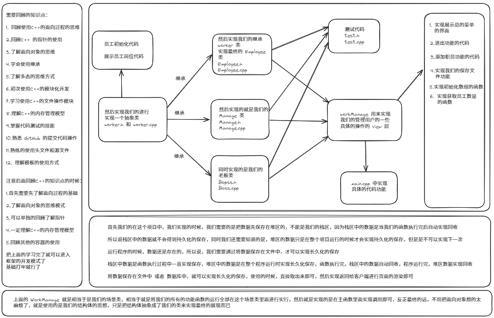

# CppProject 职工管理系统

* 职工管理系统职工分为三类
  * 普通员工， 经理， 老板
  * 显示的信息含有： 职工编号， 职工姓名， 职工岗位， 职责
* 管理系统中的需要实现的功能有：
  * 退出管理功能： 退出当前的管理系统
  * 增加职工信息： 实现批量的增加职工功能
  * 显示职工信息： 显示公司内的所有的员工信息
  * 删除离职员工： 按照编号删除离职员工
  * 修改职工信息： 按照编号实现修改职工信息
  * 查找职工信息： 根据职工有的信息查找职工
  * 按照编号对职工实现排序
  * 清空文档
* 创建整个项目实现运行的主文件
  * `EmployeeManageSystemMain.cpp`
* 创建管理类
  * 和用户进行沟通的菜单界面
  * 对员工进行增删改查的操作
  * 与文件之间的读写交互
  * `workerManage.h  和  workerManage.cpp`
* 创建职工抽象类
  * 职工的分类分为我们的 职工 经理 老板
  * 使用多态实现我们的不同的职工的分类
  * 职工具有的属性含有： 职工编号， 职工信息， 职工所在部门编号
  * 职工具有的行为： 职位信息描述， 获取岗位名称
  * 创建一个头文件： `Worker.h`  这个里面的是做为抽象类来实现的的，里面只做声明不做其他的任何操作
* 通过抽象类完成我们的员工信息类
  * `Employee.h` 和 `Employee.cpp`
* 实现完善经理类和老板类是一样的
  * 就是实现的是创建两个文件
  * `Manage.h 和 Manage.cpp`
  * `Boss.h 和 Boss.cpp`
* 添加职工
  * 首先我们实现添加职工的时候，我们应该实现的是添加到堆区中的，因为每次的栈区运行后直接销毁了
  * 然后我们实现添加操作之前我们每次都是需要开辟空间出来的，否则就会终止程序的运行
  * 然后我们需要做的最关键的事情就是实现我们的将最终的程序实现我们的读取文件的操作
  * `ios::cout` 就是我们的写文件的操作
  * `ios::in` 就是我们的读文件的操作
  * 同时根据我们的读写文件的操作判断如何进行赋值的操作，一共是分为三种情况的
  * 同时我们的写入文件的时候，我们是可以先实现我们的对内容进行加密的操作
  * 然后这个是读入文件的时候，我们是可以通过解密胡获得文件内容的，这个是十分重要的一步
* 显示职工
  * 





#### 拉取项目

```
通过 https 拉取项目:
git clone https://github.com/juwenzhang/Knowledge_Base.git

通过 SSH 拉取项目:
git clone git@github.com:juwenzhang/Knowledge_Base.git
```

#### 拉取所有分支到本地

```总和
git pull

或者使用:
git fetch
git merge

git pull 实现的是上面的两步总和，可以这么理解
```

#### 切换分支查看项目

```
git checkout 分支名
```

#### 创建分支名的规范

```
创建分支前一定要搜索对应的英文名称，做到见名思意

创建分支名的指令操作
git branch 分支名

创建分支名并且切换
git checkout -b 分支名

切换分支进行操作的指令
git checkout 分支名

查看本地分支名的操作
git branch

查看远程分支名的操作
git branch -r
```

#### 提交代码的规范

```
首先我们需要有一个要求就是
关于 readme.md 必须单独提交， 提交信息只能是: docs: upodate readme.md

其他文件的提交操作
git add .
git commit -m "desc"
git push -u origin 分支名

readme.md 的提交操作
git add readme.md
git commit -m "desc: update readme.md"
git push -u origin 分支名
```

#### 代码提交前的注意事项

```
由于是多人办公，所以说，每次提交代码到远程仓库的时候，都是需要进行 git pull 操作
将自己本地的代码进行更新，然后再提交代码
```


